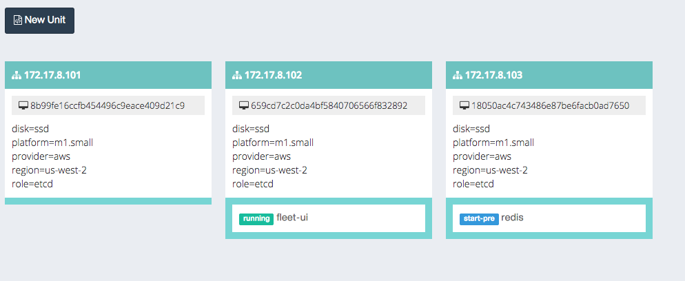

# Docker Development Env On CoreOS

A docker application/service devevlopment environment on Vagrant/CoreOS with:

* All the goodies come with CoreOS, i.e. Etcd2, Fleet, Flannel, Systemd, Journal, OS auto-updates etc.
* A [SkyDNS][SkyDNS] service.
* A [FleetUI](https://github.com/purpleworks/fleet-ui.git) service.
* Https support for web applicaitons with a wildcard self-signed certificate
* Fleet units for applications/services:
    * private docker registry with https basic-auth
    * confd
    * nginx
    * haproxy
    * haproxy-supervisor
    * mysql
    * redis
    * timer 
    * flannel

Full lists of apps are under [apps](https://github.com/xuwang/coreos-docker-dev/tree/master/apps) directory. There is a working flannel cluster in which docker containers run on their own private network than that of the docker host. 

### Installation dependencies

* [VirtualBox][virtualbox] 4.3.10 or greater.
* [Vagrant][vagrant] 1.6 or greater.

Or

* [VirtualBox][virtualbox] 5.0 or greater.
* [Vagrant][vagrant] 1.7.4 or greater.

### Clone this project

    git clone https://github.com/xuwang/coreos-docker-dev.git
    cd coreos-docker-dev

_Vagrantfile_ controls the cluster provisioning. The checked out git repo directory is shared as /home/core/share in each node, so you can put persistent data under /home/core/share. 
You will be asked for your password to enable the NFS sharing from the host.

### Cluster configuration

Under [nodes-conf](https://github.com/xuwang/coreos-docker-dev/tree/master/nodes-conf) directory, you can find different size of cluster configurations and default service port mappings.  You can modify json files to change the defaults, and in Vagrant configuration, pick the one you will use. The default is one node cluster. Note you will  need a powerful ldaptop in
order to run 3 notes cluster-large.json configuration. Memory allocation used by each node can be adjusted in <type>.json file.

    NODES_CONF = File.join(MY_PATH, "nodes-conf", "standalone.json")
    #NODES_CONF = File.join(MY_PATH, "nodes-conf", "cluster-flannel.json")
    #NODES_CONF = File.join(MY_PATH, "nodes-conf", "cluster.json")
    #NODES_CONF = File.join(MY_PATH, "nodes-conf", "cluster-large.json")
    #NODES_CONF = File.join(MY_PATH, "nodes-conf", "cluster-secure-etcd.json")

### Start the cluster

    vagrant up
    vagrant status
    vagrant ssh [<node name>]
  
Skydns service should be started automatically:

Networking on your machine might cause it not to start automatically. Try to start manually:

    sudo systemctl start skydns.service
 
Private registry should also be started automatically, again use the systemctl command to verity:

    systemctl status registry

To save a copy of the registry so it won't try to pull from dockerhub next reboot:

   dksave registry
 
The skydns and reigstry are two systemd units configured in the cluster's cloud-init. Once these two services are ready, you can start other services. 

Registry container registers itself as 'registry.docker.local' in skydns.

### Start service units

Units are located under share/apps/<service>/units directory. In general, you can start a service like so:

    cd share/apps/<service>/units
    fleetctl start <name>.service

For example, to start mysql server:

    cd share/apps/mysql/units
    fleetctl start mysql.service
    
When service is ready, it registers as 'mysql.docker.local' in skydns.

To check status of fleet units:

    fleetctl list-units

To tail a service log, for example, mysql:

    journalctl -f -u mysql.service 

Skydns domain name is cluster.local. To check skydns:

    core@n1 ~/share $ els /skydns
    /skydns/config
    /skydns/local
    /skydns/local/docker
    /skydns/local/docker/dns
    /skydns/local/docker/dns/ns
    /skydns/local/docker/dns/ns/xca8538abbd0f48d0a5382b6560294dab
    /skydns/local/docker/n1
    /skydns/local/docker/registry
    /skydns/local/docker/mysql 

You should be able to test mysql:

    ncat mysql 3306

### Start fleet UI

    cd share/apps/fleet-ui/units
    fleetctl start fleet-ui.service

It can take very long for this service to come up on laptop. This one first pull a builder image and build the fleet-ui image on the fly. To check status:

    fleetctl status fleet-ui.service

And when it is ready:

    core@n2 ~ $ fleetctl list-units
    UNIT			MACHINE				ACTIVE		SUB
    fleet-ui.service	659cd7c2.../172.17.8.102	active		running
    mysql.service		18050ac4.../172.17.8.103	activating	start-pre
    
In this example, the fleet service is running on 172.17.8.102. You can point your browser to 172.17.8.102:3000 to visualize what's running on the cluster:

### Clean it up

Exit coreos vm node and:

    vagrant destroy

[virtualbox]: https://www.virtualbox.org/
[vagrant]: https://www.vagrantup.com/downloads.html
[using-coreos]: http://coreos.com/docs/using-coreos/
[SkyDNS]: https://github.com/skynetservices/skydns
[Docker-Registry]: https://github.com/docker/docker-registry

